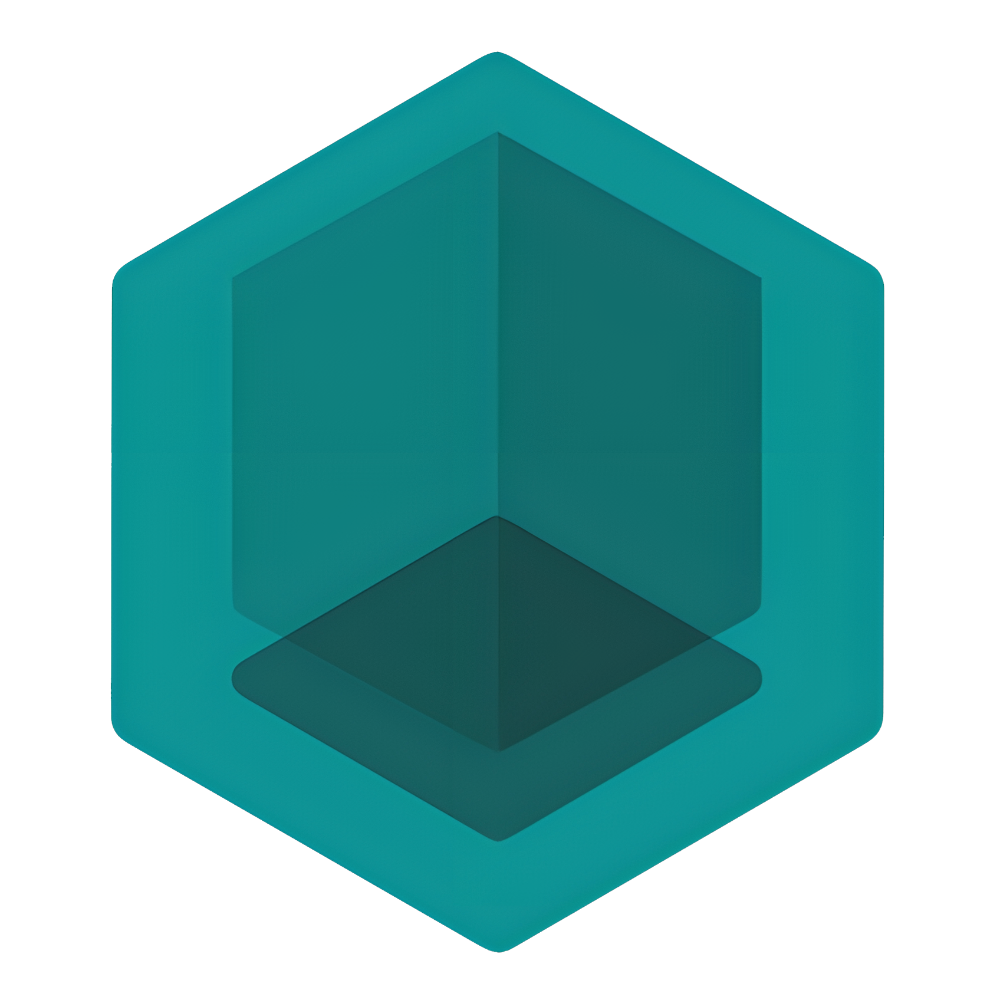

<a name="readme-top"></a>
[![Forks][forks-shield]][forks-url]
[![Stargazers][stars-shield]][stars-url]
[![Issues][issues-shield]][issues-url]
[![GPL3 License][license-shield]][license-url]
[![LinkedIn][linkedin-shield]][linkedin-url]


<!-- PROJECT LOGO -->
<br />
<div align="center">
  <a href="https://github.com/Flee-Time/F_Light">
    
  </a>

  <h3 align="center">F_Light</h3>

  <p align="center">
    A small handheld device that does 433mhz attacks. Similar to the Flipper Zero.
    <br />
    <a href="https://github.com/Flee-Time/F_Light/issues">Report Bug</a>
    ·
    <a href="https://github.com/Flee-Time/F_Light/issues">Request Feature</a>
  </p>
</div>


<!-- TABLE OF CONTENTS -->
<details>
  <summary>Table of Contents</summary>
  <ol>
    <li>
      <a href="#about-the-project">About The Project</a>
      <ul>
        <li><a href="#key-features">Key Features</a></li>
      </ul>
    </li>
    <li>
      <a href="#getting-started">Getting Started</a>
      <ul>
        <li><a href="#prerequisites">Prerequisites</a></li>
        <li><a href="#building">Building</a></li>
      </ul>
    </li>
    <li>
        <a href="#pinouts-and-connection-diagrams">Pinouts and Connection Diagrams</a>
        <ul>
            <li><a href="#prototype-device-schematics">Prototype Device Schematics</a></li>
            <li><a href="#prototype-device-images">Prototype Device Images</a></li>
        </ul>
    </li>
    <li><a href="#roadmap">Roadmap</a></li>
    <li><a href="#contributing">Contributing</a></li>
    <li><a href="#license">License</a></li>
    <li><a href="#acknowledgments">Acknowledgments</a></li>
    <li><a href="#donations">Donations</a></li>
  </ol>
</details>


<!-- ABOUT THE PROJECT -->
## About The Project

This project aims to develop a small handheld device capable of various functionalities related to 433MHz radio communication. The device allows for receiving, transmitting, copying, saving, and jamming signals within the 433MHz frequency range. Additionally, it features a 128x64 I2C OLED screen and six buttons, four for navigation and two for confirming and canceling actions.

F_Light stands for Free Light.

* At its current stage of development, the project focuses primarily on the implementation of the menu system, which provides a user-friendly interface for accessing the device's functionalities. The RF section, responsible for the actual radio communication, is yet to be implemented.


## Key Features

* **433MHz Communication:** The device is designed to work within the 433MHz frequency range, enabling it to interact with a variety of radio devices operating on this frequency.
* **Receiving:** The device can receive signals transmitted by other 433MHz devices, allowing users to monitor and analyze the data being transmitted.
* **Transmitting:** Users can utilize the device to transmit signals to other 433MHz devices, facilitating the communication between the handheld device and compatible devices.
* **Copying:** The device offers the ability to copy received signals, allowing users to replicate and retransmit the same signal multiple times.
* **Saving:** Users can save received signals for later analysis or retransmission, providing a convenient storage mechanism for important or interesting data.
* **Jamming:** The device includes a jamming functionality, which can be used to disrupt or interfere with the signals of other nearby 433MHz devices.


<!-- GETTING STARTED -->
## Getting Started

This guide will get you setup your basic development enviroment, building and running is quite simple with the PlatformIO extension.

### Prerequisites

Theres only one prerequisite right now.
* PlatformIO extension for Visual Studio Code

### Building

This is the bare minimum you have to do to get the project running on bare metal.

1. Clone the repo.
   ```sh
   git clone https://github.com/Flee-Time/F_Light.git
   ```
2. Open the cloned project in VS Code with PlatformIO.
<br>

3. _(Optional)_ Change the `platormio.ini` file to suit your prefered upload and debug method.
    ```ini
    upload_protocol = stlink
    debug_tool = stlink
    ```

4. Build and upload under the `genericSTM32F411CE/General` project tasks using the PlatformIO extension.


<!-- USAGE EXAMPLES -->
## Pinouts and Connection Diagrams

Use this space to show useful examples of how a project can be used. Additional screenshots, code examples and demos work well in this space. You may also link to more resources.

* Buttons
```
3v3  --> all_buttons
PB12 --> up_button
PB13 --> right_button
PB14 --> down_button
PB15 --> left_button
PA8  --> back_button
PA9  --> action_button
```

* OLED Display (SSD1306/SH1106)
```
PB6 --> SCL
PB7 --> SDA
3v3 --> VCC
GND --> GND
```

* ST-Link Debugger
```
PA13 --> SWDIO
PA14 --> SWCLK
3v3  --> 3v3
GND  --> GND
```

* RTC Battery
```
VBAT --> CR2032_Plus
GND  --> CR2032_Minus
```

* RF Section (CC1101) / Not implemented yet, these pins actually do nothing right now.
```
PA7 --> MOSI
PA6 --> MISO
PA5 --> SCK
PA4 --> NCS
```


## Prototype Device Schematics

Some schematics for the prototype device im using right now, keep in mind nothing is final at this stage.

<object data="https://github.com/Flee-Time/F_Light/blob/master/documentation/prototype_schematic.pdf" type="application/pdf" width="600px" height="400px">
    <embed src="https://github.com/Flee-Time/F_Light/blob/master/documentation/prototype_schematic.pdf">
        <p>This browser does not support PDFs. Please download the PDF to view it: <a href="https://github.com/Flee-Time/F_Light/blob/master/documentation/prototype_schematic.pdf">Download PDF</a>.</p>
    </embed>
</object>


## Prototype Device Images

_For pictures of the device, please refer to [here](https://github.com/Flee-Time/F_Light/blob/master/documentation/device_pictures/PICS.md)_

<!-- ROADMAP -->
## Roadmap

- [x] Update Readme
- [x] Add documentation
- [ ] Improve code readability
- [ ] Improve UI & UX
    - [ ] Finish Time & Date setttings app
    - [ ] Make Menu's more modular
- [ ] Add RF implementation
- [ ] Add SD card and filesystem support for saving recorded frequencies
- [ ] Switch to an RTOS
- [ ] Rewrite everything using a more OOP approach
- [ ] Write own hardware abstraction layer for optimization
- [ ] Make Prototype pcb with integrated components.

See the [open issues](https://github.com/Flee-Time/F_Light/issues) for a full list of proposed features (and known issues).


<!-- CONTRIBUTING -->
## Contributing

Contributions to this project are welcome! Whether it's reporting issues, suggesting improvements, or submitting pull requests, your help is appreciated. Together, we can make this handheld radio device a versatile tool for 433MHz communication.

If you have a suggestion that would make this better, please fork the repo and create a pull request. You can also simply open an issue with the tag "enhancement". Don't forget to give the project a star! Thanks again!

1. Fork the Project
2. Create your Feature Branch (`git checkout -b feature/contrib`)
3. Commit your Changes (`git commit -m 'Add some AmazingFeature'`)
4. Push to the Branch (`git push origin feature/contrib`)
5. Open a Pull Request


<!-- LICENSE -->
## License

This project is licensed under the GPL-3.0 License. Feel free to use, modify, and distribute the code according to the terms of the license. See [LICENSE](https://github.com/Flee-Time/F_Light/blob/master/LICENSE) for more information.

<!-- ACKNOWLEDGMENTS -->
## Acknowledgments

I would like to express our gratitude to the open-source community for their invaluable contributions and support, which have played a significant role in the development of this project. Thank you to all the individuals and organizations who have shared their knowledge and expertise in the field of radio communication.

* [Flipper Zero](https://flipperzero.one/)
* [u8g2 Library](https://github.com/olikraus/u8g2)
* [Best Readme Template](https://github.com/othneildrew/Best-README-Template/)

## Donations

If you find this project helpful and would like to support its development and maintenance, you can make a donation to show your appreciation. Your contribution will help ensure the project continues to grow and improve. Thank you for your generosity! 

* Donate via [Ko-fi](https://ko-fi.com/fleetime)

Your support is highly appreciated and will be acknowledged in the project's documentation.

The funds received will be used solely for the project's purposes, acquiring necessary hardware components, and supporting ongoing development efforts.

Thank you for considering making a donation! I am grateful for your support.

<!-- MARKDOWN LINKS & IMAGES -->
<!-- https://www.markdownguide.org/basic-syntax/#reference-style-links -->
[forks-shield]: https://img.shields.io/github/forks/Flee-Time/F_Light.svg?style=for-the-badge
[forks-url]: https://github.com/Flee-Time/F_Light/network/members
[stars-shield]: https://img.shields.io/github/stars/Flee-Time/F_Light.svg?style=for-the-badge
[stars-url]: https://github.com/Flee-Time/F_Light/stargazers
[issues-shield]: https://img.shields.io/github/issues/Flee-Time/F_Light.svg?style=for-the-badge
[issues-url]: https://github.com/Flee-Time/F_Light/issues
[license-shield]: https://img.shields.io/github/license/Flee-Time/F_Light.svg?style=for-the-badge
[license-url]: https://github.com/Flee-Time/F_Light/blob/master/LICENSE
[linkedin-shield]: https://img.shields.io/badge/-LinkedIn-black.svg?style=for-the-badge&logo=linkedin&colorB=555
[linkedin-url]: https://linkedin.com/in/fleetimee