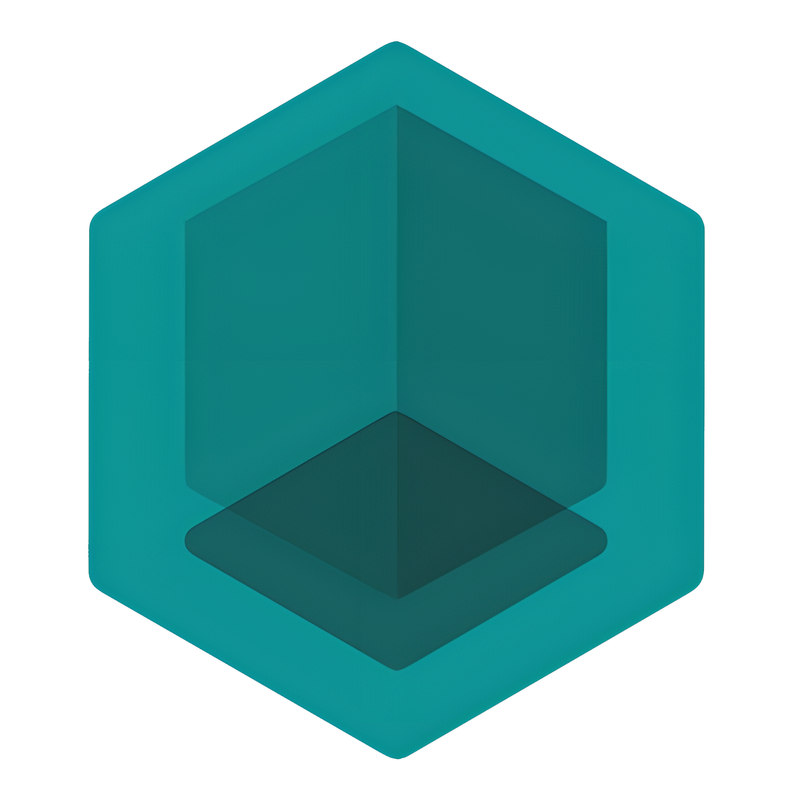

 

  

  <h3 align="center">F_Light</h3>

  

    Pictures of my current prototype device.
  

  
Keep in mind this is a prototype device, the final one will have a custom pcb made.

    <b style="font-size: 20px;">Picture of the device</b>  
      
    <b style="font-size: 20px;">Side picture of the device</b>  
      
    <b style="font-size: 20px;">Front picture of the device</b>  
      
    <b style="font-size: 20px;">Picture of the main menu.</b>  
      
    <b style="font-size: 20px;">Picture of the settings sumenu.</b>  
      
    <b style="font-size: 20px;">Another picture of the settings submenu.</b>  
      
    <b style="font-size: 20px;">Another picture of the main menu.</b>  
      
    <b style="font-size: 20px;">Picture of the set time app.</b>  
    

